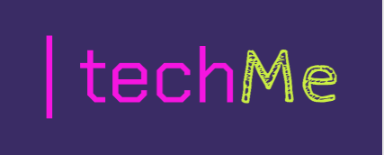

##  

## Investigacion de usuario
Hicimos una encuesta virtual para conocer las expectativas y necesidades de nuestros potenciales usuarios con los siguientes hallazgos:

1. Nuestros encuestados estuvieron principalmente en el rango de edad entre 21 y 27 años, sin embargo, hubo participantes de hasta 59 años.

2. El tema elegido mayoritariamente fue el de Tecnología.

3. Cada encuestado propuso un nombre para la red social, nosotras como equipo elegimos TechMe.

4. Pudimos visualizar en la encuesta que nuestros usuarios expresan la necesidad de poder ver publicaciones de personas que no estuvieran siguiendo en la red social, con un porcentaje del 71.4% de los participantes.

Nuestro producto final será una red social de tecnología cuya finalidad es compartir iniciativas de proyectos, noticias, preguntas a la comunidad sobre código o conceptos e historia de la tecnología con datos curiosos.

Link de Estadisticas de nuestra investigacion de usuario:

(https://docs.google.com/forms/d/1AdlquL3H6ODTbu2L1OTn45QjNINwM3KZGgaMESAnU2o/edit#responses)

## Historias de usuario
H1: Yo como desarrollador quiero poderme loguear en la red social de desarrolladores TechMe (quiero loguearme con correo y contraseña y con google).

H2: Yo como desarrollador quiero registrarme en la red social de desarrolladores Techme(correo y contraseña).

H3: Yo como desarrollador quiero poder hacer publicaciones en el muro de la red social.

H4: Yo como desarrollador quiero poder dar y recibir likes en los post.

## Prototipo de baja

## Prototipo de alta

Desko (https://www.figma.com/file/iCbkiRTP1h4rOpnPFsmony/Social-Network-TechMe?node-id=1%3A50)

Movil (https://www.figma.com/file/iCbkiRTP1h4rOpnPFsmony/Social-Network-TechMe?node-id=0%3A1)

Movil (https://www.figma.com/file/iCbkiRTP1h4rOpnPFsmony/Social-Network-TechMe?node-id=1%3A100)

### HTML y CSS

* [x ] [Uso de HTML semántico.](https://developer.mozilla.org/en-US/docs/Glossary/Semantics#Semantics_in_HTML)
* [ x] Uso de selectores de CSS.
* [ x] Construir tu aplicación respetando el diseño realizado (maquetación).
* [x ] [Uso de flexbox en CSS.](https://css-tricks.com/snippets/css/a-guide-to-flexbox/)

### DOM y Web APIs

* [x ] Uso de selectores del DOM.
* [ x] Manejo de eventos del DOM.
* [ x] [Manipulación dinámica del DOM.](https://developer.mozilla.org/es/docs/Referencia_DOM_de_Gecko/Introducci%C3%B3n)
(appendChild |createElement | createTextNode| innerHTML | textContent | etc.)
* [x ] [History API.](https://developer.mozilla.org/es/docs/DOM/Manipulando_el_historial_del_navegador)
* [ ] [localStorage.](https://developer.mozilla.org/es/docs/Web/API/Window/localStorage)

### JavaScript

* [x ] Uso de condicionales (if-else | switch | operador ternario)
* [ x] Uso de funciones (parámetros | argumentos | valor de retorno)
* [x ] Manipular arrays (filter | map | sort | reduce)
* [x ] Manipular objects (key | value)
* [ x] Uso ES modules ([`import`](https://developer.mozilla.org/en-US/docs/Web/JavaScript/Reference/Statements/import)
| [`export`](https://developer.mozilla.org/en-US/docs/Web/JavaScript/Reference/Statements/export))
* [ x] Diferenciar entre expression y statements.
* [x ] Diferenciar entre tipos de datos primitivos y no primitivos.
* [x ] [Uso de callbacks.](https://developer.mozilla.org/es/docs/Glossary/Callback_function)
* [x ] [Consumo de Promesas.](https://scotch.io/tutorials/javascript-promises-for-dummies#toc-consuming-promises)

### Testing

* [ x] [Testeo unitario.](https://jestjs.io/docs/es-ES/getting-started)
* [ x] [Testeo asíncrono.](https://jestjs.io/docs/es-ES/asynchronous)
* [ ] [Uso de librerias de Mock.](https://jestjs.io/docs/es-ES/manual-mocks)

### Estructura del código y guía de estilo

* [x ] Organizar y dividir el código en módulos (Modularización)
* [ x] Uso de identificadores descriptivos (Nomenclatura | Semántica)
* [ x] Uso de linter (ESLINT)

### Git y Github

* [x ] Uso de comandos de git (add | commit | pull | status | push)
* [ x] Manejo de repositorios de GitHub (clone | fork | gh-pages)
* [ x] Colaboración en Github (branches | pull requests | |tags)
* [ ] Organización en Github (projects | issues | labels | milestones)

### Firebase

* [x ] [Firestore.](https://firebase.google.com/docs/firestore)
* [ x] [Firebase Auth.](https://firebase.google.com/docs/auth/web/start)
* [x ] [Firebase security rules.](https://firebase.google.com/docs/rules)
* [ x] Observadores. ([onAuthStateChanged](https://firebase.google.com/docs/auth/web/manage-users?hl=es#get_the_currently_signed-in_user)
 | [onSnapshot](https://firebase.google.com/docs/firestore/query-data/listen#listen_to_multiple_documents_in_a_collection))

### UX

* [ x] Diseñar la aplicación pensando y entendiendo al usuario.
* [x ] Crear prototipos para obtener feedback e iterar.
* [ ] Aplicar los principios de diseño visual (contraste, alineación, jerarquía)
* [ x] Planear y ejecutar tests de usabilidad.

 